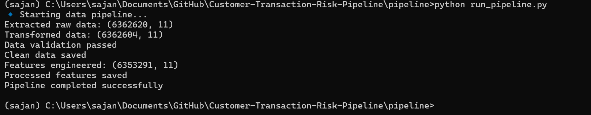
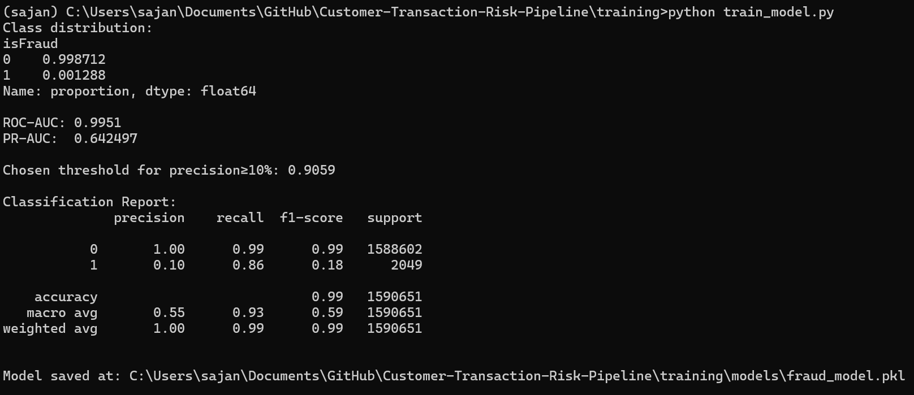

# Customer Transaction Fraud Detection Pipeline
## Overview

This project implements a production-style fraud detection pipeline for financial transactions using a realistic synthetic dataset generated by the PaySim simulator. The focus is on data engineering discipline, leakage-free modeling, and business-aware evaluation, rather than leaderboard-style optimization.

The system processes raw transaction data end-to-end, performs validation and feature engineering, and trains an interpretable machine learning model suitable for deployment in real-world financial risk systems.

## Problem Statement
- Financial fraud detection is characterized by:
- Extreme class imbalance
- Evolving fraud patterns
- Strict correctness and interpretability 
- High operational cost of false positives

This project addresses these challenges by building a reproducible transaction-level fraud detection pipeline that:
- Prevents data and temporal leakage
- Uses domain-informed behavioral features
- Evaluates models using appropriate metrics for imbalanced data
- Optimizes decision thresholds based on business constraints

## Dataset

The project uses the PaySim Financial:-
- Transactions Dataset, a synthetic dataset 
- designed to simulate mobile money transactions 
- based on real financial logs.

## Key characteristics:
- Each row represents a single transaction
- Includes multiple transaction types (TRANSFER, CASH_OUT, PAYMENT, etc.)
- Fraud labels (isFraud) reflect realistic attack patterns
- Strongly imbalanced (fraud rate ≈ 0.1%)

The dataset is treated as immutable raw input and is never modified directly.

## Pipeline Architecture

The pipeline follows a strict layered design:

##### Raw Data  
######  ↓
##### Data Cleaning
#####   ↓
##### Validation
   ##### ↓
##### Feature Engineering
   ##### ↓
##### Model Training & Evaluation

Each stage has a clearly defined responsibility and fails early if assumptions are violated.

## Data Processing & Validation

The pipeline enforces explicit data integrity checks, including:
- Schema validation
- Type coercion
- Removal of invalid or inconsistent records
- Balance consistency checks
- Logical constraints on transaction attributes

This ensures downstream components operate only on trusted data.

## Feature Engineering

Fraud detection is modeled at the transaction level, which aligns with the underlying fraud mechanism in PaySim and avoids unavoidable temporal leakage present in customer-level aggregation.

Engineered features include:
- Balance change dynamics for origin and destination accounts
- Transaction intent indicators (TRANSFER, CASH_OUT)
- Heuristic risk signals (transactions exceeding available balance, zero destination balance)
- Transaction-level numerical attributes

All features are derived exclusively from information available at transaction time.

## Modeling Approach

A cost-sensitive logistic regression model is trained using class weighting to address extreme class imbalance. Logistic regression was chosen for its:

- Interpretability
- Stability under imbalance
- Suitability for regulated financial environments
- Ease of deployment and monitoring

## Evaluation Strategy
Model performance is evaluated using metrics appropriate for imbalanced classification:
- ROC-AUC
- Precision–Recall AUC
Accuracy is intentionally not emphasized.

To reflect business constraints, the decision threshold is explicitly tuned to satisfy a minimum precision requirement rather than using the default 0.5 threshold.

This mirrors real-world fraud systems where false positives carry operational costs.

## Results (Representative)
- ROC-AUC: ~0.99
- PR-AUC: ~0.64
- Fraud recall > 80% at precision ≥ 10%

These results demonstrate strong discriminative performance while maintaining realistic trade-offs between detection coverage and false-positive rates.

## Reproducibility
- All experiments are fully reproducible.
- Run the data pipeline
       python pipeline/run_pipeline.py

  

- Train the model
       python training/train_model.py

  

## Design Decisions & Lessons Learned
- Preventing data leakage is more important than maximizing metrics
- Transaction-level modeling is essential for PaySim-style fraud data
- ROC-AUC alone is insufficient for imbalanced problems
- Business-aware thresholding provides more value than raw accuracy
- Simple, interpretable models are often preferable in regulated domains

## Limitations & Future Work
- No concept drift modeling is included
- Evaluation is performed on a static dataset
- Real-time inference is not implemented

### Potential extensions:
- Rolling time-window evaluation
- Online inference via FastAPI
- Model monitoring and drift detection

## Technologies Used
- Python
- Pandas, NumPy
- Scikit-learn
- Joblib

### Author

Sajan Kumar Sah  
B.Tech Computer Science | Applied Machine Learning   
GitHub: https://github.com/MR-SAJAN-SAH  
Portfolio: https://sajankumar.com.np
